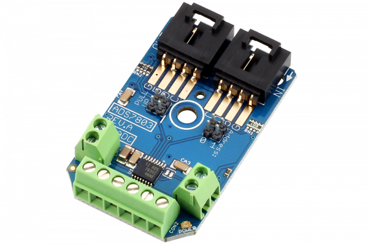

[](https://store.ncd.io/product/ads7830-8-channel-8-bit-high-speed-analog-to-digital-converter-i2c-mini-module/).

# ADS7830

The ADS7830 is an 8-Channel 8-Bit Analog to Digital Converter capable of supporting all standard I2C communications speeds.The ADS7830 is capable of high speed operation, up to 70,000 samples per second at 3.4MHz communication speed. 
This Device is available from www.ncd.io

[SKU: ADS7830]

(https://store.ncd.io/product/ads7830-8-channel-8-bit-high-speed-analog-to-digital-converter-i2c-mini-module/)
This Sample code can be used with Raspberry Pi.

Hardware needed to interface ADS7830 8Bit ADC With Raspberry Pi :

1. <a href="https://store.ncd.io/product/ads7830-8-channel-8-bit-high-speed-analog-to-digital-converter-i2c-mini-module/">ADS7830 8Bit 8-Channel ADC</a>

2. <a href="https://store.ncd.io/product/i2c-shield-for-raspberry-pi-3-pi2-with-outward-facing-i2c-port-terminates-over-hdmi-port/">Raspberry Pi I2C Shield</a>

3. <a href="https://store.ncd.io/product/i%C2%B2c-cable/">I2C Cable</a>

## Python

Download and install smbus library on Raspberry pi. Steps to install smbus are provided at:

https://pypi.python.org/pypi/smbus-cffi/0.5.1

Download (or git pull) the code in pi. Run the program.

```cpp
$> python ADS7830.py
```
The lib is a sample library, you will need to calibrate the sensor according to your application requirement.
